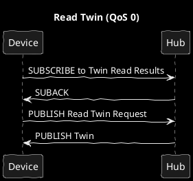
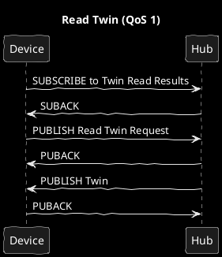
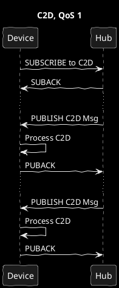

```plantuml
@startuml
title Read Twin (QoS 0)
skinparam monochrome reverse
skinparam handwritten true

Device -> Hub: SUBSCRIBE to Twin Read Results
Hub -> Device: SUBACK
Device -> Hub: PUBLISH Read Twin Request
Hub -> Device: PUBLISH Twin

@enduml
```

```plantuml
@startuml
title Read Twin (QoS 1)
skinparam monochrome reverse
skinparam handwritten true

Device -> Hub: SUBSCRIBE to Twin Read Results
Hub -> Device: SUBACK
Device -> Hub: PUBLISH Read Twin Request
Hub -> Device: PUBACK
Hub -> Device: PUBLISH Twin
Device -> Hub: PUBACK

@enduml
```

```plantuml
@startuml
title C2D, QoS 1
skinparam monochrome reverse
skinparam handwritten true

Device -> Hub: SUBSCRIBE to C2D
Hub -> Device: SUBACK
...
Hub -> Device: PUBLISH C2D Msg
Device -> Device: Process C2D
Device -> Hub: PUBACK
...
Hub -> Device: PUBLISH C2D Msg
Device -> Device: Process C2D
Device -> Hub: PUBACK
@enduml
```